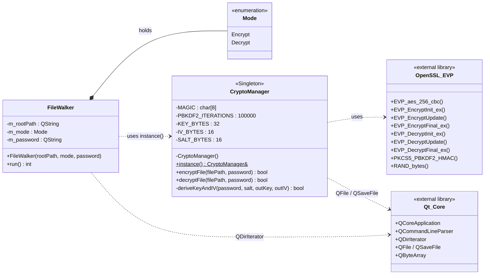

# Лабораторная №1 — FileEncryptor (DoIST)

Консольная Qt-программа, которая рекурсивно шифрует/дешифрует все файлы внутри
указанной папки и её подпапок при помощи AES-256-CBC через библиотеку OpenSSL.

## 1. Постановка задачи

Реализовать защиту данных пользовательских папок и файлов, находящихся в
указанной папке и во всех её подпапках, путём шифрования. Для получения
исходного содержимого выполняется обратная операция — дешифрование.

Требования к реализации:

* интерфейс приложения — консоль;
* алгоритм шифрования — AES-256;
* язык — C++;
* класс, выполняющий шифрование/дешифрование, реализован как **Singleton**;
* входные данные: путь к папке и пароль (через аргументы командной строки);
* программа не должна иметь утечек памяти и падений из-за необработанных
  исключений.

## 2. Предлагаемое решение

Программа получает в командной строке режим (`--encrypt` / `--decrypt`),
путь к папке и пароль, после чего рекурсивно обходит дерево каталогов и
для каждого файла:

* при шифровании — выводит из пароля 32-байтовый ключ AES + 16-байтовый
  IV через **PBKDF2-HMAC-SHA256** (функция OpenSSL `PKCS5_PBKDF2_HMAC`)
  со случайной 16-байтовой солью, шифрует содержимое в режиме **CBC**
  (с автоматическим дополнением до блока 16 байт, обеспечиваемым OpenSSL)
  и перезаписывает файл в формате `MAGIC | salt | IV | ciphertext`;
* при дешифровании — читает заголовок, восстанавливает ключ и IV,
  расшифровывает и записывает на место исходное содержимое. Неверный
  пароль обнаруживается по нарушению дополнения внутри
  `EVP_DecryptFinal_ex`.

Использованные сущности:

| Сущность         | Тип                          | Назначение                                                                                       |
|------------------|------------------------------|--------------------------------------------------------------------------------------------------|
| `CryptoManager`  | класс, **Singleton (Meyers)** | Шифрование и дешифрование одного файла. Реализует PBKDF2 и AES-256-CBC через OpenSSL EVP API.    |
| `FileWalker`     | обычный класс                | Рекурсивный обход дерева через `QDirIterator`, делегирует работу `CryptoManager::instance()`.    |
| `main()`         | точка входа                  | Разбор аргументов через `QCommandLineParser`, валидация, запуск `FileWalker`.                    |

Используемые технологии:

* **Qt Core 5.15.2** — кроссплатформенная работа с файлами и каталогами
  (`QDirIterator`, `QFile`), разбор аргументов командной строки
  (`QCommandLineParser`).
* **OpenSSL (EVP API)** — `EVP_aes_256_cbc` для AES-256-CBC,
  `PKCS5_PBKDF2_HMAC` для вывода ключа из пароля, `RAND_bytes` для
  генерации соли.

Паттерн **Singleton** реализован через статическую локальную переменную
внутри `CryptoManager::instance()`. Это гарантирует ровно один экземпляр
на программу, ленивую и потокобезопасную инициализацию (стандарт C++11
§6.7), а явный запрет копирования и присваивания не позволяет создать
второй экземпляр.

## 3. Архитектура программы



## 4. Инструкция пользователя

Запуск из консоли:

```
FileEncryptor --encrypt --path <папка> --password <пароль>
FileEncryptor --decrypt --path <папка> --password <пароль>
```

Короткие формы:

```
FileEncryptor -e -p ./demo -k mySecret
FileEncryptor -d -p ./demo -k mySecret
```

Аргументы:

* `-e, --encrypt` — режим шифрования;
* `-d, --decrypt` — режим дешифрования;
* `-p, --path <directory>` — путь к папке (обязательный);
* `-k, --password <secret>` — пароль (обязательный);
* `--help`, `--version` — справка и версия.

Пример сценария (структура `demo/` → `notes.txt`, `img/photo.jpg`, `sub/data.bin`):

```
$ FileEncryptor --encrypt --path ./demo --password "qwerty123"
Encrypting all files in: ./demo
[Encrypt] OK: "./demo/notes.txt"
[Encrypt] OK: "./demo/img/photo.jpg"
[Encrypt] OK: "./demo/sub/data.bin"
Done. Files processed successfully: 3

$ FileEncryptor --decrypt --path ./demo --password "qwerty123"
Decrypting all files in: ./demo
[Decrypt] OK: "./demo/notes.txt"
[Decrypt] OK: "./demo/img/photo.jpg"
[Decrypt] OK: "./demo/sub/data.bin"
Done. Files processed successfully: 3
```

## 5. Тестирование (входные данные / действия — реакция программы)

| #  | Входные данные / действия                                                                | Ожидаемая реакция                                                                                                  |
|----|------------------------------------------------------------------------------------------|--------------------------------------------------------------------------------------------------------------------|
| 1  | `--encrypt --path ./demo --password pass` (папка существует, обычные файлы)              | Все файлы зашифрованы in-place, начинаются с заголовка `FENC…`. Код возврата `0`.                                  |
| 2  | `--decrypt --path ./demo --password pass` после теста №1                                  | Файлы возвращаются к исходному содержимому, побайтово совпадают с оригиналом. Код возврата `0`.                    |
| 3  | `--decrypt --path ./demo --password WRONG` после теста №1                                 | Для каждого файла: `[Decrypt] EVP_DecryptFinal_ex failed — bad password or corrupted file: …`.                     |
| 4  | `--encrypt --path ./demo --password pass` дважды подряд                                   | Второй запуск выводит `[Encrypt] Already encrypted, skipping: …` и не удваивает шифрование.                        |
| 5  | `--encrypt --path /nonexistent --password pass`                                          | `Error: directory does not exist: …`. Код возврата `1`.                                                            |
| 6  | `--encrypt --path ./demo` (без `--password`)                                              | `Error: --password is required.` + справка. Код возврата `1`.                                                       |
| 7  | `--encrypt --decrypt --path ./demo --password pass` (оба режима сразу)                    | `Error: specify exactly one of --encrypt or --decrypt.` + справка. Код возврата `1`.                                |
| 8  | `--decrypt --path ./demo --password pass`, в папке лежит обычный (не наш) файл            | `[Decrypt] Not an encrypted file, skipping: …` — файл не повреждается. Код возврата `0`.                            |
| 9  | Шифрование пустого файла                                                                  | Файл превращается в `MAGIC | salt | IV | 16 байт ciphertext` (один блок дополнения). Дешифрование возвращает пустой файл. |
| 10 | Папка содержит ≥ 1000 файлов в нескольких уровнях вложенности                             | Все обрабатываются за один проход без переполнения стека (итеративный `QDirIterator`).                              |
| 11 | После шифрования сняты права на запись и запущено дешифрование                            | `[Decrypt] Cannot write: …`. Программа продолжает работу, остальные файлы не повреждаются.                          |
| 12 | Запуск с `--help`                                                                         | Печать справки и `exit(0)`.                                                                                          |
